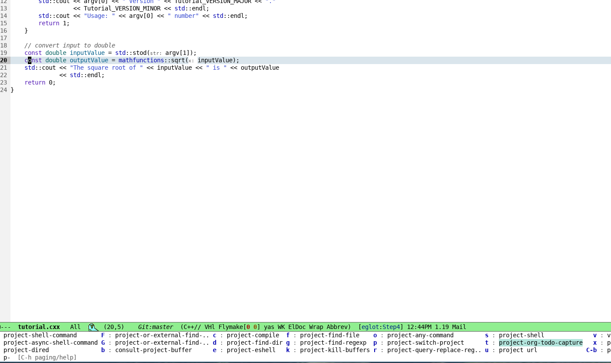
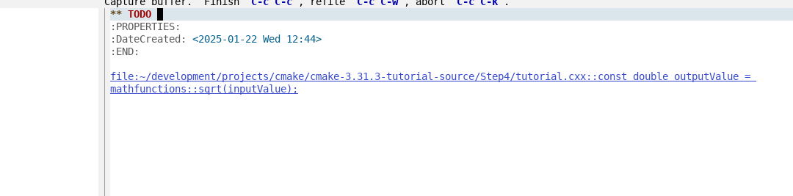

# Table of Contents

-   [Introduction](#org0610657)
    -   [core functions](#orgecab6c9)
        -   [project-org-todo-capture](#orgb7504de)
        -   [project-org-todo-capture-file-open](#org5672714)
-   [Installation](#org1ec496b)
    -   [standard clone or copy](#org9fb46af)
        -   [getting the code](#orgb895b46)
        -   [add to loadpath](#org8327261)
        -   [require it](#orged0d594)
        -   [bind to it](#org13678ff)
    -   [straight](#orgb19f87e)
    -   [elpaca](#org5c85d3f)
-   [customisation](#org4fecd01)
    -   [customisable variables](#org1b2bb43)
    -   [project specific customisations](#org38788df)

# Introduction

Enable todo capture for an Emacs [project](https://www.gnu.org/software/emacs/manual/html_node/emacs/Projects.html). Uses the builtin emacs project infratructure, not [projectile](https://github.com/bbatsov/projectile).

Add a key to Emacs project-prefix-map

and  enter a project specific TODO.

## core functions

### project-org-todo-capture

Create a project TODO item.

### project-org-todo-capture-file-open

Open the project TODO file

# Installation

Some sample key binds in the examples.

## standard clone or copy

### getting the code

-   clone the repo :

        git clone https://github.com/rileyrg/project-org-todo-capture

-   copy the code project-org-todo-capture.el

    link: [project-org-todo-capture.el](project-org-todo-capture.el)

### add to loadpath

    (add-to-list 'load-path "where you cloned/copied it to")

### require it

    (require 'project-org-todo-capture)

### bind to it

    (define-key project-prefix-map "t" 'project-org-todo-capture)

## straight

    (use-package project-org-todo-capture
      :after project
      :straight (project-org-todo-capture :type git :host github :repo "rileyrg/project-org-todo-capture" )
        :bind (:map project-prefix-map
                    (("t" . project-org-todo-capture)
                    ("T" . project-org-todo-capture-file-open))))

## elpaca

    (use-package project-org-todo-capture
      :ensure (:host github :repo "rileyrg/project-org-todo-capture" )
      :bind (:map project-prefix-map
                    (("t" . project-org-todo-capture)
                    ("T" . project-org-todo-capture-file-open))))

# customisation

## customisable variables

    (defcustom project-org-todo-capture-template)
    (defcustom project-org-todo-capture-default-file)
    (defcustom project-org-todo-capture-auto-append-to-agenda)

## project specific customisations

You can change the default TODO org file for a specific project by using  [directory local variables](https://www.gnu.org/software/emacs/manual/html_node/emacs/Directory-Variables.html).

eg in file :

> $PROJECT\_ROOT/.dir-locals.el

      ;;; Directory Local Variables            -*- no-byte-compile: t -*-
    ;;; For more information see (info "(emacs) Directory Variables")
    
    ((nil . ((project-org-todo-capture-default-file . "doh.org"))))

